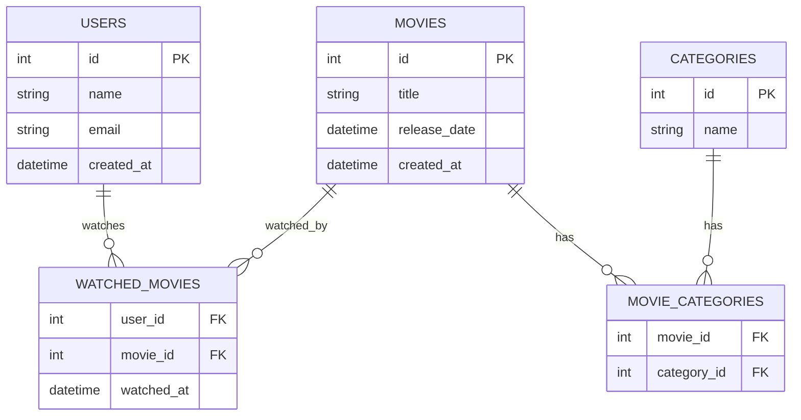

# Movie API 🎬

API REST para gestión de películas y usuarios, desarrollada con Node.js, Express y TypeScript.

## 📁 Repositorio
[URL del repositorio](https://github.com/Andss-ye/MovieAPI/tree/main)

## 🗄️ Modelo Relacional de la Base de Datos



## 📝 Script SQL de la Base de Datos

```sql
-- Creación de tablas
CREATE TABLE users (
    id SERIAL PRIMARY KEY,
    name VARCHAR(255) NOT NULL,
    email VARCHAR(255) NOT NULL UNIQUE,
    created_at TIMESTAMP DEFAULT CURRENT_TIMESTAMP
);

CREATE TABLE categories (
    id SERIAL PRIMARY KEY,
    name VARCHAR(255) NOT NULL
);

CREATE TABLE movies (
    id SERIAL PRIMARY KEY,
    title VARCHAR(255) NOT NULL,
    release_date TIMESTAMP NOT NULL,
    created_at TIMESTAMP DEFAULT CURRENT_TIMESTAMP
);

CREATE TABLE movie_categories (
    movie_id INTEGER REFERENCES movies(id),
    category_id INTEGER REFERENCES categories(id),
    PRIMARY KEY (movie_id, category_id)
);

CREATE TABLE watched_movies (
    user_id INTEGER REFERENCES users(id),
    movie_id INTEGER REFERENCES movies(id),
    watched_at TIMESTAMP DEFAULT CURRENT_TIMESTAMP,
    PRIMARY KEY (user_id, movie_id)
);
```

## 🚀 API REST en Heroku
[URL de la API en Heroku](https://movie-api-by-andrew-eff439bc0461.herokuapp.com/api/)

## 📚 Documentación de la API

La documentación de la API está disponible en Swagger UI:
- URL: `https://movie-api-by-andrew-eff439bc0461.herokuapp.com/api/docs/`

### Endpoints Principales

#### Películas
- `POST /api/movies/create` - Crear una nueva película
- `GET /api/movies` - Obtener todas las películas (con filtros)
- `GET /api/movies/newMovies` - Obtener películas nuevas
- `POST /api/movies/markAsWatched` - Marcar una película como vista

#### Usuarios
- `POST /api/users/create` - Crear un nuevo usuario
- `GET /api/users/watched` - Obtener usuarios con sus películas vistas

## 📋 Cuestionario Técnico

### Preguntas Básicas

1. **¿Cuál es el propósito de "module.exports"?**
   - Permite exportar variables, objetos y funciones de un archivo de Node.js para que puedan ser reutilizadas en otra parte del programa usando require()

2. **¿Qué es un middleware?**
   - Un middleware es una funcion intermedia en la cual se hace algo y si retorna alguna cosa pasa la siguiente funcionalidad en el flujo de la peticion, tambien tiene
   acceso a los objetos de req y res

3. **¿Cuál es la diferencia entre código bloqueante y código no bloqueante?**
   - **Código bloqueante**: El codigo bloqueante lo que hace es bloquear el flujo de logica hasta que no termine la tarea la cual esta haciendo. **codigo sincronico**
   - **Código no bloqueante**: Por esta parte el codigo no bloqueante puede seguir operando y haciendo ciertas tareas del programa segun lo requiera usando **callbacks y funciones async/await**

4. **¿Qué biblioteca de javascript usaría para manejar datos en tiempo real?**
   - Usaria Socket.io ya que he escuchado que adapta los websockets nativos para hacerlos mas sencillo y facilitar la comunicacion entre cliente y servidor.

### Preguntas Plus

5. **¿Cuál es la principal ventaja de trabajar un proyecto dockerizado?**
   - La ventaja de trabajar con docker es el poder mantener las dependencias, archivos del sistema operativo con relacion al proyecto y configuraciones **para que funcione en cualquier entorno**

6. **¿Cuál es la diferencia entre una imagen y un volumen en Docker?**
   - Una **imagen** es una plantilla que contiene el codigo, configuraciones, dependencias y demas para ejecutar el proyecto
   - Un **volumen** se utiliza para poder almacenar datos de forma persistentes

7. **¿Con qué herramienta se puede orquestar un proyecto con múltiples imágenes en docker?**
   - Con un compose

8. **¿Cuál es la principal ventaja de trabajar con cluster de kubernetes?**
   - La escalabilidad de entornos de desarrollo y la disponibilidad
