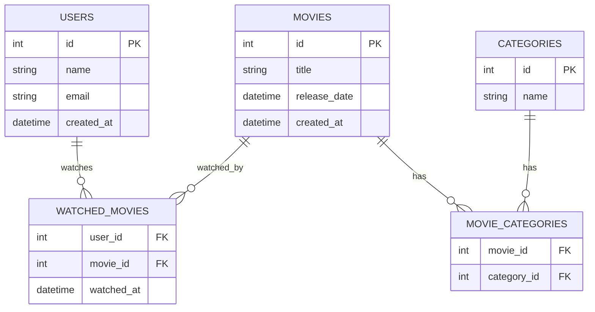

# Movie API 🎬 (API OFFLINE)

API REST para gestión de películas y usuarios, desarrollada con Node.js, Express y TypeScript.

## 📁 Repositorio
[URL del repositorio](https://github.com/Andss-ye/MovieAPI/tree/main)

## 🗄️ Modelo Relacional de la Base de Datos



## 📝 Script SQL de la Base de Datos

```sql
-- Creación de tablas
CREATE TABLE users (
    id SERIAL PRIMARY KEY,
    name VARCHAR(255) NOT NULL,
    email VARCHAR(255) NOT NULL UNIQUE,
    created_at TIMESTAMP DEFAULT CURRENT_TIMESTAMP
);

CREATE TABLE categories (
    id SERIAL PRIMARY KEY,
    name VARCHAR(255) NOT NULL
);

CREATE TABLE movies (
    id SERIAL PRIMARY KEY,
    title VARCHAR(255) NOT NULL,
    release_date TIMESTAMP NOT NULL,
    created_at TIMESTAMP DEFAULT CURRENT_TIMESTAMP
);

CREATE TABLE movie_categories (
    movie_id INTEGER REFERENCES movies(id),
    category_id INTEGER REFERENCES categories(id),
    PRIMARY KEY (movie_id, category_id)
);

CREATE TABLE watched_movies (
    user_id INTEGER REFERENCES users(id),
    movie_id INTEGER REFERENCES movies(id),
    watched_at TIMESTAMP DEFAULT CURRENT_TIMESTAMP,
    PRIMARY KEY (user_id, movie_id)
);
```
### Endpoints Principales

#### Películas
- `POST /api/movies/create` - Crear una nueva película
- `GET /api/movies` - Obtener todas las películas (con filtros)
- `GET /api/movies/newMovies` - Obtener películas nuevas
- `POST /api/movies/markAsWatched` - Marcar una película como vista

#### Usuarios
- `POST /api/users/create` - Crear un nuevo usuario
- `GET /api/users/watched` - Obtener usuarios con sus películas vistas
